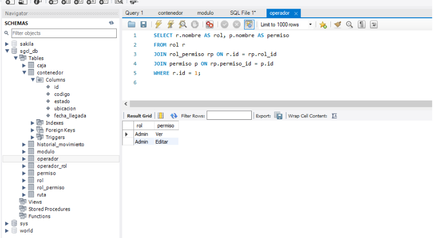

# Sistema de Gestión de Contenedores y Logística

Este proyecto contiene los scripts SQL y el esquema de base de datos para el **Sistema de Gestión de Contenedores y Logística (SGCL)**. El proyecto incluye los comandos SQL necesarios para crear la base de datos, insertar datos iniciales y realizar consultas.

## Descripción de la Base de Datos

La base de datos consiste en las siguientes entidades principales:

- **Operador**: Contiene información sobre los operadores en el sistema.
- **Rol**: Define los roles asignados a los operadores.
- **Permiso**: Especifica los permisos otorgados a los roles.
- **Ubicación**: Gestiona las ubicaciones de los contenedores.
- **Contenedor**: Almacena información sobre los contenedores.
- **Módulo**: Define los módulos dentro de los contenedores.
- **Caja**: Almacena información sobre las cajas dentro de los módulos.
- **Ruta**: Define las rutas para los movimientos de contenedores.
- **Historial Movimiento**: Rastrea los movimientos de contenedores y cajas.

## Creación del Esquema y Tablas

A continuación se encuentran los comandos SQL necesarios para la creación de la base de datos y las tablas:

```sql
CREATE DATABASE sgcl_db;

USE sgcl_db;

-- Creación de tablas

CREATE TABLE operador (
    id INT PRIMARY KEY AUTO_INCREMENT,
    nombre VARCHAR(100),
    contraseña VARCHAR(100)
);

CREATE TABLE historial_movimiento (
    id INT PRIMARY KEY AUTO_INCREMENT,
    operador_id INT,
    fecha TIMESTAMP,
    tipo VARCHAR(50),
    item_id INT,
    item_type VARCHAR(50),
    FOREIGN KEY (operador_id) REFERENCES operador(id)
);

CREATE TABLE contenedor (
    id INT PRIMARY KEY AUTO_INCREMENT,
    codigo VARCHAR(50),
    estado VARCHAR(50),
    ubicacion VARCHAR(100),
    fecha_llegada TIMESTAMP
);

CREATE TABLE modulo (
    id INT PRIMARY KEY AUTO_INCREMENT,
    contenedor_id INT,
    codigo VARCHAR(50),
    descripcion VARCHAR(100),
    estado VARCHAR(50),
    peso FLOAT,
    FOREIGN KEY (contenedor_id) REFERENCES contenedor(id)
);

CREATE TABLE caja (
    id INT PRIMARY KEY AUTO_INCREMENT,
    modulo_id INT,
    codigo VARCHAR(50),
    estado VARCHAR(50),
    contenido VARCHAR(100),
    FOREIGN KEY (modulo_id) REFERENCES modulo(id)
);

CREATE TABLE ruta (
    id INT PRIMARY KEY AUTO_INCREMENT,
    caja_id INT,
    origen VARCHAR(100),
    destino VARCHAR(100),
    tiempo_estimado VARCHAR(100),
    urgencia VARCHAR(50),
    FOREIGN KEY (caja_id) REFERENCES caja(id)
);

CREATE TABLE permiso (
    id INT PRIMARY KEY AUTO_INCREMENT,
    nombre VARCHAR(50),
    descripcion VARCHAR(100)
);

CREATE TABLE rol (
    id INT PRIMARY KEY AUTO_INCREMENT,
    nombre VARCHAR(50),
    descripcion VARCHAR(100)
);

CREATE TABLE operador_rol (
    operador_id INT,
    rol_id INT,
    PRIMARY KEY (operador_id, rol_id),
    FOREIGN KEY (operador_id) REFERENCES operador(id),
    FOREIGN KEY (rol_id) REFERENCES rol(id)
);

CREATE TABLE rol_permiso (
    rol_id INT,
    permiso_id INT,
    PRIMARY KEY (rol_id, permiso_id),
    FOREIGN KEY (rol_id) REFERENCES rol(id),
    FOREIGN KEY (permiso_id) REFERENCES permiso(id)
);

INSERT INTO operador (nombre, contraseña) VALUES ('su', '1234') ;
INSERT INTO operador (nombre, contraseña) VALUES ('Juan', '1245');

INSERT INTO rol (id, nombre) VALUES (1, 'Admin');
INSERT INTO rol (id, nombre) VALUES (2, 'Operador');

INSERT INTO permiso (id, nombre) VALUES (1, 'Ver');
INSERT INTO permiso (id, nombre) VALUES (2, 'Editar');

INSERT INTO operador_rol (operador_id, rol_id) VALUES (1, 1);
INSERT INTO operador_rol (operador_id, rol_id) VALUES (2, 2);

INSERT INTO rol_permiso (rol_id, permiso_id) VALUES (1, 1);
INSERT INTO rol_permiso (rol_id, permiso_id) VALUES (1, 2);
INSERT INTO rol_permiso (rol_id, permiso_id) VALUES (2, 1);

```

## Capturas de Pantalla

Aquí están algunas capturas de pantalla de la base de datos en acción:





## Uso

1. Clona este repositorio.
2. Ejecuta el script SQL proporcionado (`sgcl_db_script.sql`) para crear la base de datos y las tablas.
3. Inserta los datos de ejemplo y ejecuta las consultas según sea necesario.

Siente la libertad de explorar el esquema y extenderlo para más funcionalidades.
